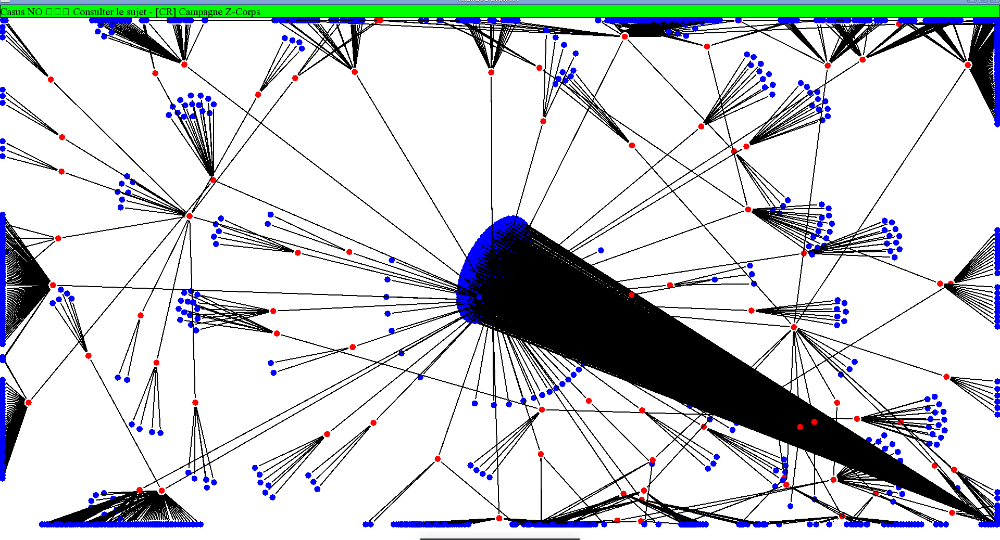

# Islanded Browser

This is a in gestation personal experience for the [Stigmee](https://github.com/stigmee) for displaying your (Firefox) browser bookmarks as an 3D island.

Notes:
- I wrote *bookmarks* not *tabs* because I never have 500 tabs opened in my browser but have so many unorganized bookmarks.
- I used Firefox, I do not use Chrome browser but I guess the process is identical.
- You can click on the picture below, to see my Youtube tutorial [](https://youtu.be/_IjCipUK8Bk) but with real collection of bookmarks, the graph is currently not displayed well as showned in the screenshot.

## Compilation process

Prerequisites: You need a g++, makefile, openmp and the library libsfml. They are easily install on your operating system.

Step one: git clone the [IslandedBrowser](https://github.com/Lecrapouille/IslandedBrowser) repository but do not compile it yet!
In your Linux console, type the following command:

```
git clone https://github.com/Lecrapouille/IslandedBrowser.git --depth=1
cd IslandedBrowser
```

Step two: organize your Firefox bookmarks and save them as JSON file:
- Move your favorite URL into folders.
- Give them some more explicit names.
- Add some tags separated by commas.
- See this video on how to open the bookmarks organizer window: https://youtu.be/ZCSd5wcHcnQ

Step three: Save your Firefox bookmarks as JSON file into `IslandedBrowser/bookmarks/bookmarks.json`:
- On Firefox, do not click on the button "export to HTML" but instead on the button "Save..."
- Save to this location: `IslandedBrowser/bookmarks/bookmarks.json`.
- See this video on how to save the bookmarks: https://youtu.be/n-aw0ZNRby0

Step four: Compile the IslandedBrowser:
- `make -j8`
- The Makefile will do it for you: it will call the Python3 `bookmarks/bookmark.py` to generate the C++ source file in `src/bookmarks.cpp` from `bookmarks/bookmarks.json`.
- You can run the application: `./build/IslandedBrowser`

Step five: Click on an URL this will open your Firefox. Click on a node this will open all URLs as child.
- Bookmarks are in blue.
- Folders are in red.

## Algorithm

Pipeline:
- The JSON file is parsed in to two separated set: folders and URLs. This is considered as low cost database.
- The folder and URL sets are parsed into a graph.
- The graph is expanded through a force-directed-graphs algorithm.

Under developement:
- The expanded graph is converted into a 3D scene.
- A spatial hash is used to fasten URL search when the user is clicking on the scene.

## Work in progress

- The force-directed-graphs algorithm is slow.
- Thinking on how to generate heigh maps from the graph.
- Generate 3D meshes and use OpenGL.
- Display URL when mouse is pointing on node

## Limitation

- A 450 Kb JSON file is long to get the graph expanded.
- I finally not sure that expanded graph looks nice. Bookmarks are not a balanced tree but looks like more a flat tree.

## Example src/Bookmarks.cpp

```c++
#include "IslandedBrowser.hpp"

void IslandedBrowser::init(Bookmarks& bookmarks, Folders& folders)
{
    folders =
    {
        { 0, { .title = "", .id = 0, .parent = 0 } },
        { 2, { .title = "Bookmarks Toolbar", .id = 2, .parent = 0 } },
        { 1660, { .title = "qq", .id = 1660, .parent = 2 } },
    };

    bookmarks =
    {
        { 1722, { .title = "DMT004 Decentralized Meta Transactions - Google Docs", .uri = "https://docs.google.com/document/d/1U_fN6fbhdHBUnbibeWhgwtDbDFLSeSk3wu60VVo9ykw/edit", .id = 1722, .parent = 1660 } },
        { 1723, { .title = "Équipements Arts Martiaux et Sports de Combat – VMA Self Défense", .uri = "https://vmaselfdefense-online.com/collections/equipement-art-martiaux", .id = 1723, .parent = 1660 } },
        { 1724, { .title = "chromiumembedded / cef / wiki / BranchesAndBuilding — Bitbucket", .uri = "https://bitbucket.org/chromiumembedded/cef/wiki/BranchesAndBuilding", .id = 1724, .parent = 1660 } },
        { 1725, { .title = "limmh/cef_mfc_demo: Integrating Chromium Embedded Framework (CEF) in a sample MFC application", .uri = "https://github.com/limmh/cef_mfc_demo", .id = 1725, .parent = 1660 } },
        { 1726, { .title = "CEF3 C++ API Docs - Version 80.1.4+g8927396+chromium-80.0.3987.149", .uri = "https://magpcss.org/ceforum/apidocs3/", .id = 1726, .parent = 1660 } },
        { 1727, { .title = "Feature: Vulkan Support · Issue #631 · NVIDIA/nvidia-docker", .uri = "https://github.com/NVIDIA/nvidia-docker/issues/631", .id = 1727, .parent = 1660 } },
        { 1728, { .title = "A Simple Windows Example Using the Chromium Embedded Framework 3 - CodeProject", .uri = "https://www.codeproject.com/Tips/785840/A-Simple-Windows-Example-Using-the-Chromium-Embedd", .id = 1728, .parent = 1660 } },
        { 1729, { .title = "fphammerle/docker-brave-browser: brave-browser https://brave.com/ 🐳", .uri = "https://github.com/fphammerle/docker-brave-browser", .id = 1729, .parent = 1660 } },
        { 1730, { .title = "How can I generate a Git patch for a specific commit? - Stack Overflow", .uri = "https://stackoverflow.com/questions/6658313/how-can-i-generate-a-git-patch-for-a-specific-commit", .id = 1730, .parent = 1660 } },
        { 1731, { .title = "git - How to shallow clone a specific commit with depth 1? - Stack Overflow", .uri = "https://stackoverflow.com/questions/31278902/how-to-shallow-clone-a-specific-commit-with-depth-1", .id = 1731, .parent = 1660 } },
        { 1732, { .title = "Pinterest", .uri = "https://www.pinterest.fr/", .id = 1732, .parent = 1660 } },
        { 1733, { .title = "zouzias/docker-boost: Docker images for Boost's C++ libraries", .uri = "https://github.com/zouzias/docker-boost", .id = 1733, .parent = 1660 } },
        { 1734, { .title = "Docker Hub", .uri = "https://hub.docker.com/repository/docker/lecrapouille/chreage", .id = 1734, .parent = 1660 } },
    };
}
```

## References

- Philipp Kindermann Youtube videos [Force-Directed Drawings (1/3)](https://youtu.be/WWm-g2nLHds)
- https://github.com/qdHe/Parallelized-Force-directed-Graph-Drawing
